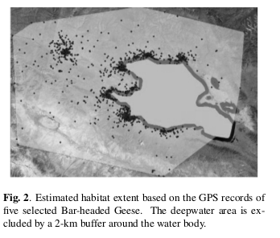
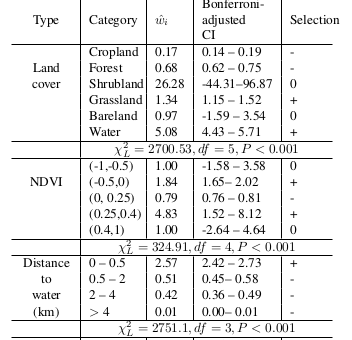

# Habitat Use Analysis

A Python-based program that used to investigate the habitat use patterns of Bar-headed Geese by combining multi-source satellite images with bird GPS records, using Log-likelihood chi-square test to explore the waterfowl habitat preferences. 

- Paper:  Investigating Waterfowl Habitat-Use Patterns with Multi-Source Remote Sensing Data

- Link: https://ieeexplore.ieee.org/abstract/document/8518583/

 